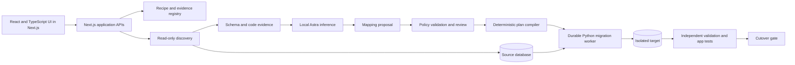

# DM architecture and integration

Status: Technology responsibilities accepted by the owner on 5 October 2026; implementation has not started. Pin framework versions and integration contracts in S02 after inspecting existing Astra code.

## Component responsibilities

| Component | Authority and restrictions |
|---|---|
| Control API | Authenticates actors, checks tenancy, records operations and policy; does not accept arbitrary SQL as a job |
| Discovery connectors | Read selected catalogs and records under scoped credentials; report unsupported object types |
| Evidence retrieval | Selects schema/code fragments with commit/path/hash; treats their contents as data |
| Astra adapter | Returns typed proposals, evidence references and unresolved questions; has no database write credentials |
| Mapping registry | Immutable versions, review decisions, recipe compatibility and plan hashes |
| Compiler | Validates identifiers/types/operations and generates parameterized steps from approved mapping |
| Execution worker | Streams batches, persists progress and handles retries; cannot broaden its plan |
| Validator | Independent target queries and business/app checks; cannot waive failures |
| Cutover controller | Separate short-lived authority to fence writes and switch the application's connection/configuration |
| Evidence store | Encrypted restricted manifests, reports and journals with retention policies |

## Accepted application stack

| Layer | Selected responsibility |
|---|---|
| React + TypeScript through Next.js | All customer/operator migration screens, review forms, progress and reports |
| Next.js application backend | Authenticated application APIs, project/configuration metadata, permission checks, job admission and authorized progress/report access |
| Python migration service and workers | Discovery, plan compilation, database batch processing, validation, durable execution and recovery |
| Local Astra inference service | Evidence-grounded mapping proposals, clarification, bounded error diagnosis and report explanations |

Next.js provides both the React application and its application-facing backend; a separate React/Vite application is not required. The complete backend includes Python workers and Astra, not just Next.js. Framework/Node/Python versions, queue/storage implementation and deployment topology remain implementation decisions. No cloud hosting dependency is introduced.

Long-running work must be durably accepted before the Next.js API returns an operation ID, normally with HTTP 202. Do not run a migration inside a browser session, request handler or untracked background promise. Python owns the migration state machine and target commit receipts; Next.js exposes authorized commands and projections, not a competing job authority. Use authenticated service-to-service requests, idempotency keys and reconciliation if job submission acknowledgement is lost.

Progress uses authenticated polling initially; resumable event streaming is an optional improvement. Reloading/closing the browser or restarting the Next.js process must not cancel accepted work. UI reconnect reads durable job state; pause/cancel remain explicit requests until acknowledged by the worker. Qualify Next.js request/hosting limits separately from worker execution limits. [Next.js backend-for-frontend guidance](https://nextjs.org/docs/app/guides/backend-for-frontend)

## Records and invariants

Project; connection profile; secret reference; schema snapshot; repository snapshot; profile report; mapping version; unresolved question; recipe; execution authorization; compiled plan; migration run; batch checkpoint; ID map; row disposition; validation result; cutover event; recovery event; evidence object; audit event.

Every record includes workspace/project identity and a stable ID. Plans bind schema fingerprints, code commits, connector/compiler/model versions, snapshot identifiers, mapping and policy hashes. Secrets are stored outside plans. Logs use opaque references rather than connection strings or row values.

Persist target rows, ID mappings and batch commit receipts in one target transaction when supported. Control-plane progress is a projection of those receipts. If a commit response is lost, reconcile the receipt before retrying. Do not claim distributed exactly-once execution across unrelated systems. See [execution protocol](07-execution-cutover-and-recovery.md).

## Proposed API contracts

| Endpoint | Result and concurrency rule |
|---|---|
| POST /projects | Workspace-scoped project; idempotency key |
| POST /projects/{id}/connections | Secret reference and supported profile; credentials never echoed |
| POST /projects/{id}/discoveries | Durable read-only job with limits and explicit objects |
| POST /projects/{id}/mapping-proposals | Model/config/evidence-bound proposal; no writes |
| PUT /mappings/{id} | New version from expected prior version; stale edit returns conflict |
| POST /mappings/{id}/reviews | Actor, decision, evidence and remaining questions |
| POST /plans | Compile approved mapping; reject missing coverage or unsupported rules |
| POST /plans/{id}/rehearsals | New isolated target and durable operation ID |
| POST /plans/{id}/authorizations | Scoped execution window, authority and reviewed evidence hash |
| POST /plans/{id}/runs | Recheck prerequisites; repeated logical request returns same run |
| POST /runs/{id}/pause | Stop at safe checkpoint; expose requested versus effective status |
| POST /runs/{id}/resume | Reconcile target receipts and revalidate scope before work |
| POST /runs/{id}/cutovers | Separately authorized, state-checked operation |
| GET /runs/{id}/report | Authorized immutable report; distinguish incomplete from failed |

Typed failures: unsupported, ambiguous, unauthorized, stale_plan, incompatible_target, source_changed, validation_failed, resource_limit, outcome_unknown and recovery_required. A timeout never implies a rollback happened.

## Integration boundaries

Reuse Astra evaluation, job and audit components only after product-specific contract/security tests. Existing PostgreSQL index migration is an implementation reference, not a general connector. The migration service owns run state and data validation. The [WS commercial plan](../../AI-Product-Website-Sales-and-Subscription/docs/02-architecture-and-integration.md) owns subscriptions/entitlements if adopted; select one authoritative identity and usage service. No customer data or credentials enter the public website or browser storage.
