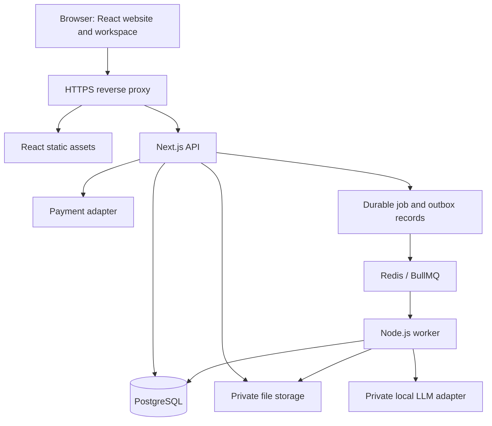

# Architecture and recommended stack

## Required frontend and backend

Use React.js with TypeScript and Vite in `apps/web`. Use Next.js App Router Route Handlers in `apps/api` for HTTP APIs. Next.js is itself a React framework, but this plan uses its server routing separately from the requested React frontend.

Retain the existing Astra Python/PyTorch service as the model runtime behind its private authenticated versioned gateway. Next.js is the product backend, not a rewrite of Astra. Use a server-only TypeScript adapter and validated contract manifest. The [Astra mapping](11-astra-llm-feature-mapping.md) is authoritative for reuse, gaps, and release qualification.

A Node.js worker in `apps/worker` is an optional product-owned process for parsing, PDF generation and coordinating bounded Astra requests. Reuse Astra's durable job authority for supported Astra tools/DAGs; persist the remote job ID instead of giving the same operation two worker owners. Do not hold a browser request open for lengthy work. S01/S07 decides whether a product queue is needed and records operation ownership.

Serve the browser and API under the same public origin: React routes at `/` and Next.js APIs under `/api`. During development, Vite proxies `/api` to localhost:3000. In production a reverse proxy performs that routing. This keeps cookie-based sessions manageable.

## Component diagram



## Recommended components

| Component | Recommendation | Reason / timing |
|---|---|---|
| Shared language | TypeScript | Shared validation and explicit contracts |
| Frontend | React, Vite, React Router | Independent UI and backend; S01 |
| Server state / forms | TanStack Query, React Hook Form, Zod | Loading, errors, validation; S02-S04 |
| Styling | CSS modules and shared design tokens initially | Accessible controls without unnecessary framework decisions |
| Database | PostgreSQL, Drizzle ORM, node-postgres | Relational records, migrations, transactions; S01-S03 |
| Authentication | Better Auth with a reviewed PostgreSQL adapter | Sessions, verification, recovery; S02; version compatibility spike required |
| Money calculations | decimal.js and explicit currency rules | Avoid binary floating-point arithmetic for business amounts; S05/S10 |
| Jobs | Astra durable jobs for Astra operations; optional BullMQ/Redis for product jobs | Separate execution ownership, bounded retries and reconciliation; S07 |
| Local AI | Existing Astra native runtime through private authenticated gateway | Reuse Python runtime and manifest; qualify extraction capability in S08/S17 |
| Files | Private filesystem adapter for development; regional object storage for hosted release | Separate document access from public assets; S06/S16 |
| PDF extraction | Isolated parser adapter, selected after fixtures | Must preserve page references; S06 |
| OCR | Optional isolated OCR adapter, benchmark before selection | Add Python only if a chosen OCR tool requires it |
| PDF generation | Server-side controlled HTML rendered by a worker, e.g. Playwright Chromium | Stable quote output; S12 |
| Tests | Vitest, Testing Library, Playwright | Calculations, access rules, integration and customer journeys |
| Operations | Product-specific infrastructure decision; preserve existing Astra runtime baseline | Astra Compose Sprint 188 was stopped/removed; no supported Astra container profile is assumed |
| Billing | Provider adapter; implement one eligible provider first | Region and seller eligibility remain open; S14 |
| Email | Provider-neutral transactional adapter | Verification, recovery, billing notices; development mail sink in S02 |

Recommendations are architecture choices, not claims that every library combination has been tested. Resolve versions and lock them during S01. Official references are in [references](10-references.md).

## Suggested application source layout

This is the layout to create during implementation; the current folder contains planning only.

```text
application/
  apps/
    web/src/{pages,features,components,lib,locales}
    api/src/app/api/{auth,v1,webhooks}
    api/src/server/{auth,services,repositories,adapters}
    worker/src/{processors,adapters,dispatch}
  packages/
    contracts/           # Zod schemas and API types; no secrets
    domain/              # calculations and state rules
    db/                  # Drizzle schemas and reviewed migrations
  infra/
  tests/{integration,e2e,fixtures,ai-evaluation}
```

Use a modular monolith first. The API and worker share domain rules; neither imports UI code. A package import/export and TypeScript compilation strategy is defined and checked in S01 before sharing code.

## Request and job behavior

The API validates session, membership, role, workspace entitlement, input, and idempotency key. For expensive work it reserves the product allowance and inserts durable intent plus an outbox entry in one transaction. A dispatcher uses the selected execution backend. For Astra-owned operations, save the remote job ID and reconcile before resubmission. Product-owned workers, if adopted, use durable IDs and idempotent writes; repeated dispatch must not duplicate quotes or billable usage. The diagram illustrates this optional product queue, not a replacement for Astra jobs.

Poll job status initially; real-time streaming is optional later. Distinguish stage-event progress from token streaming. Recheck permissions, entitlement policy and cancellation before work begins. If Redis is adopted, retain authoritative product records outside it. Astra's job/usage stores remain separate authorities for remote execution; product allowance units are not Astra token usage.

No browser can call the model, database, queue, or payment secret endpoints directly. Model output is untrusted data, not code or an authorized action.

## Public website discovery

The React application contains public marketing pages and authenticated pages. At S13 select build-time prerendering for public routes or another reviewed React rendering option if search visibility requires it. Verify actual HTML titles/content and crawler behavior. Do not assume a client-only SPA provides the desired search presentation.

